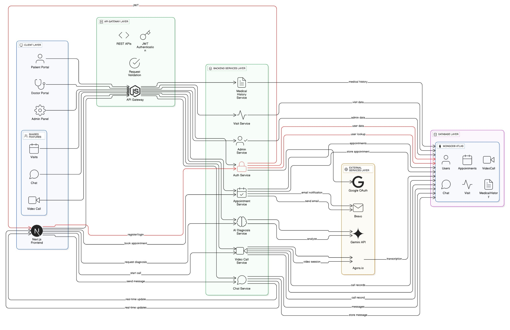

# MedConnect Frontend

A modern, responsive healthcare management web application built with Next.js 16, React 19, and TypeScript. This application provides a comprehensive platform for patients and doctors to manage appointments, conduct video consultations, and maintain medical records.

## 🚀 Features

### For Patients
- **Appointment Booking**: Browse available doctors and book appointments
- **Video Consultations**: Join video calls with doctors via Agora RTC
- **Medical History**: View and manage medical records and visit summaries
- **Doctor Search**: Find doctors by specialization
- **Real-time Chat**: Communicate with healthcare providers
- **Appointment Management**: Track appointment status (pending, accepted, completed)

### For Doctors
- **Patient Management**: View and manage patient list
- **Appointment Handling**: Accept/reject appointment requests
- **Visit Summaries**: Create detailed clinical visit records
- **Video Consultations**: Conduct video calls with patients
- **Patient History**: Access complete patient medical history
- **Chat System**: Communicate with patients

### For Admins
- **Doctor Management**: Add, update, and remove doctor accounts
- **User Oversight**: Manage system users and roles
- **System Configuration**: Control application settings

### Technical Features
- **Authentication**: JWT-based auth with Google OAuth integration
- **Role-Based Access**: Separate interfaces for patients, doctors, and admins
- **Responsive Design**: Mobile-first, fully responsive UI
- **Real-time Updates**: Live appointment status updates
- **Secure Communication**: HTTPS-ready with secure token handling
- **Modern UI**: Tailwind CSS 4 with gradient designs and animations

## 🏗️ Architecture Overview

The MedConnect platform follows a modern, scalable architecture designed for healthcare applications. The system is built with a clear separation of concerns, utilizing Next.js for the frontend and Node.js/Express for the backend, with MongoDB as the database layer.



### Key Components

- **Frontend Layer**: Next.js 16 with React 19, TypeScript, and Tailwind CSS
- **API Gateway**: RESTful API with Express.js and JWT authentication
- **Service Layer**: Modular controllers for appointments, video calls, chat, and medical records
- **Data Layer**: MongoDB with Mongoose ODM for data persistence
- **External Services**: 
  - Agora.io for video/audio communication
  - Brevo for email notifications
  - Google OAuth for authentication
  - AI services for clinical summaries

For detailed backend architecture, see the [backend documentation](../b2b-backend/README.md).

## 📋 Prerequisites

- **Node.js** >= 18.0.0
- **npm** or **yarn**
- **Backend API** running (see [backend documentation](../b2b-backend/README.md))

## 🛠️ Installation

### 1. Clone the repository

```bash
git clone <repository-url>
cd b2b-frontend
```

### 2. Install dependencies

```bash
npm install
# or
yarn install
```

### 3. Environment Configuration

Create a `.env.local` file in the root directory:

```bash
cp .env.example .env.local
```

Update the `.env.local` file with your configuration. See [Environment Variables](#-environment-variables) section.

### 4. Start the development server

```bash
npm run dev
# or
yarn dev
```

Open [http://localhost:3000](http://localhost:3000) in your browser.

## 🔐 Environment Variables

Create a `.env.local` file with the following variables:

| Variable | Description | Example |
|----------|-------------|---------|
| `NEXT_PUBLIC_API_URL` | Backend API base URL | `http://localhost:5000/api` |
| `NEXT_PUBLIC_AGORA_APP_ID` | Agora Application ID for video calls | Get from [Agora Console](https://console.agora.io/) |

**Note**: Variables prefixed with `NEXT_PUBLIC_` are exposed to the browser.

## 📁 Project Structure

```
b2b-frontend/
├── src/
│   ├── app/                    # Next.js App Router
│   │   ├── (auth)/            # Authentication pages
│   │   │   ├── login/
│   │   │   └── register/
│   │   ├── admin/             # Admin dashboard
│   │   │   └── doctors/
│   │   ├── dashboard/         # Main dashboard
│   │   ├── doctor/            # Doctor-specific pages
│   │   │   ├── appointments/
│   │   │   ├── patients/
│   │   │   ├── reports/
│   │   │   └── chat/
│   │   ├── patient/           # Patient-specific pages
│   │   │   ├── doctors/
│   │   │   ├── appointments/
│   │   │   ├── book-appointment/
│   │   │   ├── reports/
│   │   │   └── chat/
│   │   ├── video-call/        # Video consultation page
│   │   ├── medical-history/   # Medical records
│   │   ├── layout.tsx         # Root layout
│   │   ├── page.tsx          # Landing page
│   │   └── globals.css       # Global styles
│   ├── components/            # Reusable components
│   │   ├── Navbar.tsx
│   │   └── ...
│   ├── context/              # React Context providers
│   │   └── AuthContext.tsx
│   ├── lib/                  # Utility functions
│   │   └── api.ts
│   └── types/                # TypeScript types
│       ├── appointment.ts
│       ├── user.ts
│       └── ...
├── public/                   # Static assets
├── .env.local               # Environment variables (git-ignored)
├── .env.example            # Environment template
├── next.config.ts          # Next.js configuration
├── tailwind.config.ts      # Tailwind CSS configuration
├── tsconfig.json           # TypeScript configuration
├── package.json            # Dependencies
└── README.md              # This file
```

## 🎨 UI/UX Features

- **Modern Design**: Gradient-based color scheme with violet/fuchsia accents
- **Responsive Layout**: Mobile-first design that works on all devices
- **Smooth Animations**: Micro-interactions and transitions
- **Dark Mode Ready**: Architecture supports theme switching
- **Accessible**: WCAG compliant with proper ARIA labels
- **Loading States**: Skeleton screens and loading indicators
- **Error Handling**: User-friendly error messages

## 🔐 Authentication Flow

1. **Login/Register**: Users can sign up with email or Google OAuth
2. **JWT Tokens**: Access and refresh tokens stored securely
3. **Role Assignment**: Users assigned patient role by default
4. **Admin Management**: Admins create doctor accounts
5. **Protected Routes**: Middleware guards authenticated pages
6. **Auto Logout**: Token expiration handling

## 📱 Pages Overview

### Public Pages
- `/` - Landing page
- `/login` - User login
- `/register` - User registration

### Patient Pages
- `/dashboard` - Patient dashboard with quick actions
- `/patient/doctors` - Browse and select doctors
- `/patient/appointments` - View appointment history
- `/patient/book-appointment` - Schedule new appointments
- `/patient/reports` - Access medical reports
- `/patient/chat` - Message doctors

### Doctor Pages
- `/dashboard` - Doctor dashboard with patient overview
- `/doctor/appointments` - Manage appointment requests
- `/doctor/patients` - View patient list
- `/doctor/reports` - Generate visit summaries
- `/doctor/chat` - Patient communications

### Admin Pages
- `/admin/doctors` - Manage doctor accounts

### Shared Pages
- `/video-call/:channelName` - Video consultation room
- `/medical-history` - Medical records (patients)

## 🎥 Video Call Integration

The application uses **Agora RTC** for video consultations:

1. **Token Generation**: Backend generates secure Agora tokens
2. **Channel Creation**: Unique channel per appointment
3. **Real-time Communication**: HD video/audio streaming
4. **Call Controls**: Mute, camera toggle, screen share
5. **Call History**: Track call duration and status

## 🔨 Build Commands

```bash
# Development
npm run dev          # Start development server

# Production
npm run build        # Create optimized production build
npm run start        # Start production server

# Linting
npm run lint         # Run ESLint
```

## 🚀 Deployment

### Vercel (Recommended)

1. **Push to GitHub/GitLab/Bitbucket**
2. **Import project to Vercel**
3. **Add environment variables** in Vercel dashboard
4. **Deploy**

```bash
# Or use Vercel CLI
npm install -g vercel
vercel
```

### Other Platforms

#### Netlify
```bash
# Build command
npm run build

# Publish directory
.next
```

#### Docker
```dockerfile
FROM node:18-alpine

WORKDIR /app
COPY package*.json ./
RUN npm install
COPY . .
RUN npm run build

EXPOSE 3000
CMD ["npm", "start"]
```

### Environment Variables for Production

Ensure these are set in your deployment platform:

- `NEXT_PUBLIC_API_URL` - Your production backend URL
- `NEXT_PUBLIC_AGORA_APP_ID` - Agora App ID

## 🧪 Development Tips

### Hot Reload
Next.js supports fast refresh. Changes appear instantly without losing component state.

### API Integration
All API calls go through `/src/lib/api.ts` which handles:
- Token management
- Error handling
- Request/response interceptors
- Base URL configuration

### Type Safety
TypeScript interfaces in `/src/types/` ensure type safety across the application.

## 🐛 Troubleshooting

### Build Errors

**Issue**: Module not found
```bash
# Clear cache and reinstall
rm -rf .next node_modules
npm install
```

**Issue**: Type errors
```bash
# Regenerate types
npm run build
```

### Runtime Issues

**Issue**: API connection failed
- Check `NEXT_PUBLIC_API_URL` is correct
- Verify backend is running
- Check CORS settings in backend

**Issue**: Video calls not working
- Verify `NEXT_PUBLIC_AGORA_APP_ID` is set
- Check Agora console for app status
- Ensure backend is generating tokens correctly

**Issue**: OAuth redirect errors
- Check Google OAuth callback URLs
- Verify backend OAuth configuration

### Development Issues

**Issue**: Port 3000 already in use
```bash
# Use different port
PORT=3001 npm run dev
```

**Issue**: Styles not updating
```bash
# Clear Tailwind cache
rm -rf .next
npm run dev
```

## 🔒 Security Best Practices

- **Environment Variables**: Never commit `.env.local`
- **API Keys**: Use server-side API calls for sensitive operations
- **XSS Protection**: React automatically escapes content
- **CSRF**: Tokens included in all API requests
- **Authentication**: Protected routes via middleware
- **HTTPS**: Always use HTTPS in production

## 📊 Performance Optimization

- **Code Splitting**: Automatic with Next.js App Router
- **Image Optimization**: Next.js `<Image>` component
- **Lazy Loading**: Dynamic imports for heavy components
- **Caching**: API response caching where appropriate
- **Bundle Analysis**: Use `@next/bundle-analyzer`

## 🤝 Contributing

1. Fork the repository
2. Create a feature branch (`git checkout -b feature/amazing-feature`)
3. Commit your changes (`git commit -m 'Add amazing feature'`)
4. Push to the branch (`git push origin feature/amazing-feature`)
5. Open a Pull Request

## 📝 Code Style

- **ESLint**: Run `npm run lint` before committing
- **TypeScript**: Maintain strict type checking
- **Components**: Use functional components with hooks
- **Naming**: PascalCase for components, camelCase for functions
- **File Structure**: Group related files together

## 📚 Additional Resources

- [Next.js Documentation](https://nextjs.org/docs)
- [React Documentation](https://react.dev)
- [Tailwind CSS](https://tailwindcss.com/docs)
- [Agora RTC Documentation](https://docs.agora.io/)
- [TypeScript Handbook](https://www.typescriptlang.org/docs/)

## 📧 Support

For issues or questions:
- Open an issue in the repository
- Contact the development team
- Check existing documentation

---

**Built with ❤️ using Next.js 16 & React 19**
